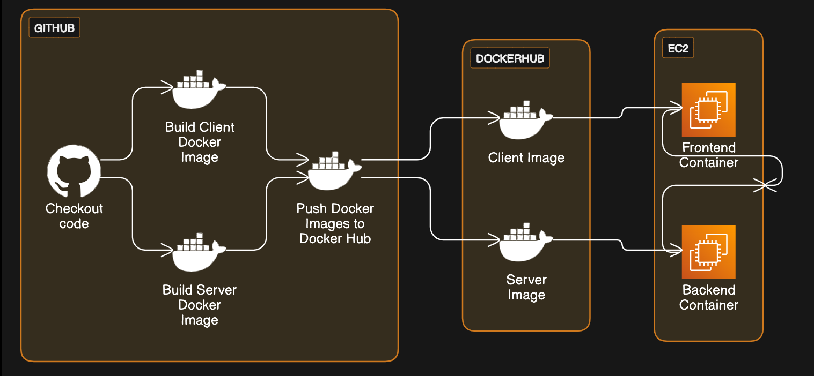
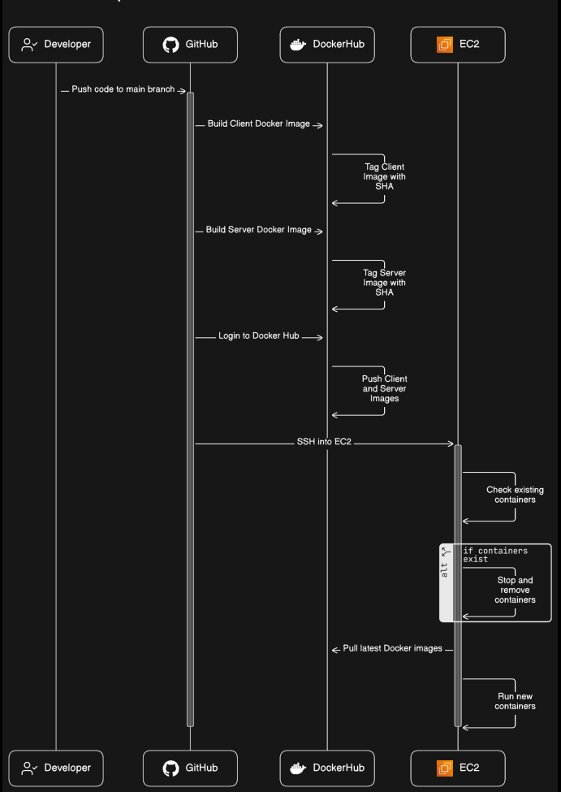

# Fullstack App – DevOps CI/CD Pipeline 🚀

The demonstrates a **production-style DevOps pipeline** for a **Dockerized fullstack app** (Spring Boot + Angular), built and deployed automatically using **GitHub Actions**, **Docker Hub**, and **AWS EC2**.

---

## Application Overview

- **Frontend**: Angular application served by **Nginx**
- **Backend**: Spring Boot REST API
- **Containerization**: Docker (multi-stage builds)
- **CI/CD**: GitHub Actions
- **Registry**: Docker Hub
- **Deployment Target**: AWS EC2

---

## High-Level Architecture



### CI Flow (Build & Push)

**Flow:**
1. Developer pushes code to `main`
2. GitHub Actions checks out the repository
3. Frontend & Backend Docker images are built
4. Images are tagged (`latest` + commit SHA)
5. Images are pushed to Docker Hub

---

### CD (Continuous Deployment)

**Flow:**
1. GitHub Actions connects to EC2 via SSH
2. Existing containers are stopped
3. Latest images are pulled from Docker Hub
4. New containers are started via Docker Compose
5. Application is live immediately



---

## Repository Structure

```text
.
├── backend/                # Spring Boot API
│   └── Dockerfile
│   └── README.md
├── frontend/               # Angular + Nginx
│   └── Dockerfile
│   └── README.md
├── docker-compose.prod.yml # Production deployment
├── docker-compose.dev.yml  # Dev environment
├── .github/workflows/
│   └── cicd.yml            # CICD pipeline
└── README.md               

